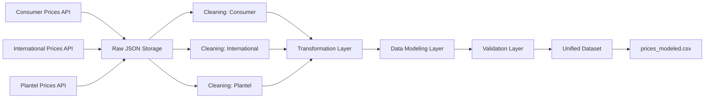

# Recope Fuel Data Pipeline

## Overview

End-to-end data engineering pipeline that extracts, processes, validates, and models fuel price data from RECOPE (Refinadora Costarricense de Petróleo).

The pipeline integrates multiple real-world data sources and produces a unified dataset ready for analysis and future analytics workloads.

---

## Pipeline Architecture



---

## Data Sources

### Consumer Prices

Local fuel prices for consumers in Costa Rica.

- Currency: CRC
- Unit: Liters

### International Prices

International reference fuel prices.

- Currency: USD
- Unit: Undefined / reference market unit

### Plantel Prices

Industrial and bulk fuel prices.

- Currency: CRC
- Units: KG / PL

All data is retrieved from RECOPE REST APIs and stored in raw JSON format.

---

## Pipeline Workflow

The pipeline follows a modular data engineering workflow:

### 1. Data Ingestion

- Fetch data from RECOPE APIs
- Store raw JSON snapshots in `data/raw/` with a timestamp suffix (e.g. `consumer_prices_20260507_101824.json`)
- Each pipeline run appends new files — old files are not deleted automatically
- The pipeline always processes the most recently created file per source


### 2. Data Cleaning

- Normalize field names
- Parse dates and numeric values
- Remove malformed records
- Add ingestion metadata

### 3. Data Transformation

- Convert cleaned JSON into CSV format
- Standardize schemas across datasets

### 4. Data Modeling

- Merge all datasets into a unified table
- Normalize currencies
- Standardize schema structure
- Introduce `price_unit` to preserve unit context

### 5. Data Validation

Validation layer includes:

- Null checks
- Duplicate detection
- Negative price detection
- Schema validation
- Fail-fast behavior on critical errors

---

## Project Structure

```text
Recope-fuel-data-pipeline/

data/
├── raw/
└── processed/

logs/
└── pipeline.log

scripts/
├── fetch/
│   ├── fetch_consumer_prices.py
│   ├── fetch_international_prices.py
│   └── fetch_plantel_prices.py
├── transform/
│   ├── clean_consumer_prices.py
│   ├── clean_international_prices.py
│   ├── clean_plantel_prices.py
│   ├── transform_consumer_prices.py
│   ├── transform_international_prices.py
│   ├── transform_plantel_prices.py
│   └── model_prices_data.py
├── quality/
│   └── validate_prices.py
└── utils/
    └── logger.py


README.md
requirements.txt
.gitignore
run_pipeline.py
```

---

## Final Output

### File

```text
data/processed/prices_modeled.csv
```

### Unified Schema

| Column | Description |
|---|---|
| date | Effective date |
| product | Fuel product name |
| source | Data source |
| price | Original price |
| currency | Original currency |
| unit | Original measurement unit |
| price_unit | Combined currency + unit |
| price_crc | Normalized CRC price |
| product_id | Product identifier |
| ingestion_timestamp | Pipeline ingestion timestamp |

### Intermediate Outputs

The pipeline also produces the following intermediate files in `data/processed/`:

| File | Description |
|---|---|
| `consumer_prices_cleaned.json` | Cleaned consumer prices, output of the cleaning step |
| `international_prices_cleaned.json` | Cleaned international prices, output of the cleaning step |
| `plantel_prices_cleaned.json` | Cleaned plantel prices, output of the cleaning step |
| `consumer_prices.csv` | Consumer prices in CSV format, output of the transformation step |
| `international_prices.csv` | International prices in CSV format, output of the transformation step |
| `plantel_prices.csv` | Plantel prices in CSV format, output of the transformation step |

These files are not the final output but are preserved for debugging and auditability.


---

## Logging & Monitoring

The pipeline includes centralized logging with:

- Step-level execution tracking
- Persistent log storage
- Error logging
- Fail-fast exception handling
- Pipeline observability

Logs are stored in:

```text
logs/pipeline.log
```

---

## Current Status

Pipeline fully implemented with:

- End-to-end orchestration
- Real-world API integration
- Modular ETL architecture
- Centralized logging
- Data quality validation
- Unified data modeling
- Currency normalization
- Structured CSV outputs
- Fail-fast pipeline behavior

---

## Design Decisions

The modeled dataset preserves original measurement units and currencies to avoid introducing invalid assumptions during normalization.

Current design principles:

- No physical unit conversion is applied (e.g., KG → L)
- International prices preserve original market units
- Currency normalization (USD → CRC) is applied separately
- Data fidelity is prioritized over forced comparability

### Currency Conversion Note

USD to CRC conversion uses a fixed exchange rate (`USD_TO_CRC = 540`).
This rate is hardcoded and does not reflect real-time market rates.
Price comparisons involving international prices should account for this limitation.


### Implications

The dataset is currently suitable for:

- Data storage
- Exploration
- Auditing
- Historical tracking
- Future analytical modeling

The dataset is not yet suitable for:

- Direct cross-source price comparison
- Unit-equivalent analytics

---

## Pending Improvements

- Expand validation rules
- Add automated unit and integration tests
- Implement orchestration tools (Airflow / Prefect)
- Add workflow scheduling
- Containerize pipeline with Docker
- Add CI/CD workflows
- Introduce analytics-ready marts
- Persist modeled data into a database

---

## Tech Stack

- Python
- Pandas
- Requests
- JSON
- CSV
- Logging
- Git / GitHub

---

## How to Run

### Run Full Pipeline

```bash
python run_pipeline.py
```

---

## Example Pipeline Flow

```text
Fetch APIs
    ↓
Store Raw JSON
    ↓
Clean Data
    ↓
Transform to CSV
    ↓
Model Unified Dataset
    ↓
Validate Data Quality
    ↓
Generate prices_modeled.csv
```

---

## Version

Current stable release:

```text
v1.0
```